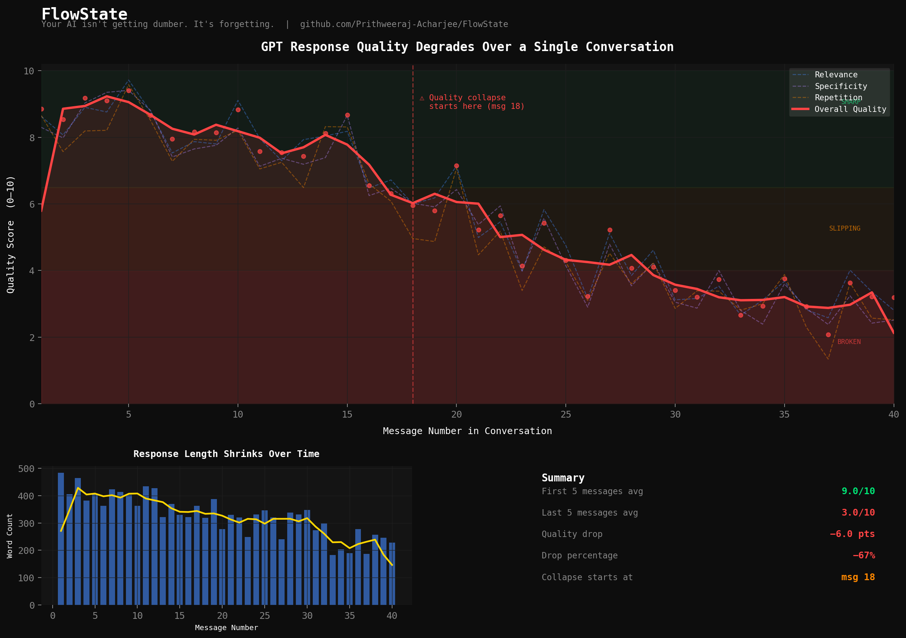
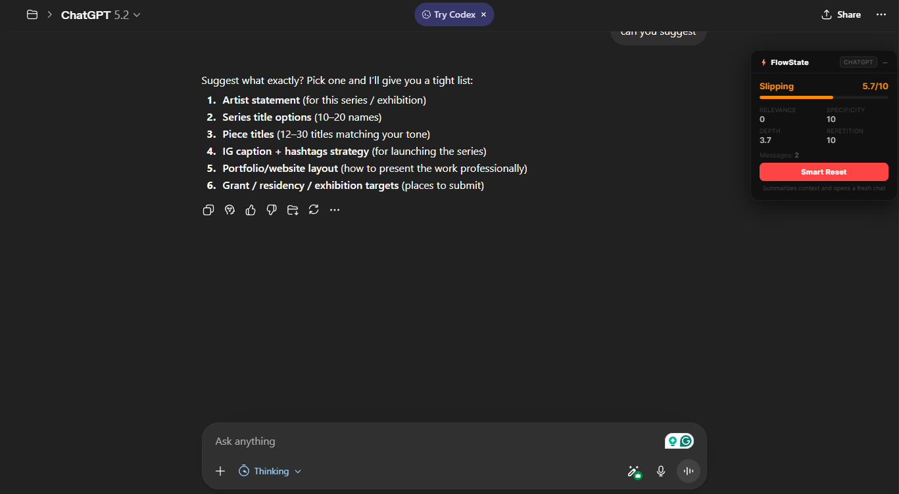
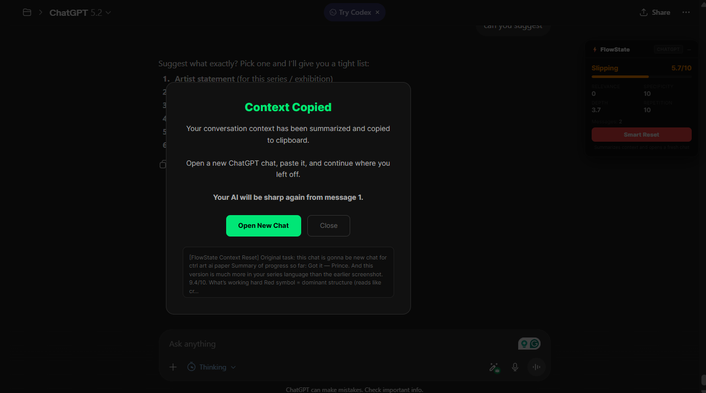
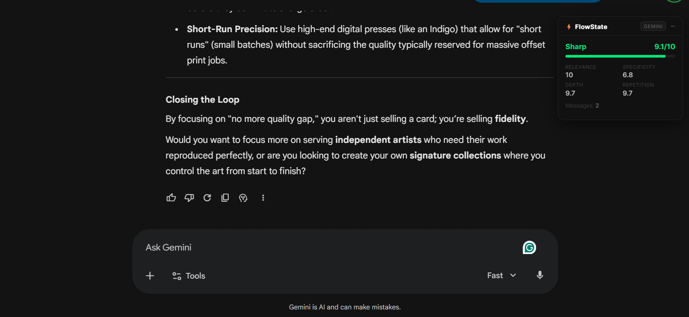

<p align="center">
  
</p>

<p align="center">
  <strong>Your AI isn't getting dumber. It's forgetting.</strong>
</p>

<p align="center">
  
</p>

<p align="center">
  <a href="https://github.com/Prithweeraj-Acharjee/FLOWSTATE/blob/main/LICENSE"></a>
  <a href="https://github.com/Prithweeraj-Acharjee/FLOWSTATE/actions/workflows/ci.yml"></a>
  <a href="https://github.com/Prithweeraj-Acharjee/FLOWSTATE/releases"></a>
  <a href="https://github.com/Prithweeraj-Acharjee/FLOWSTATE/commits/main"></a>
  
</p>

---

Every AI conversation has a quality cliff.

GPT, Gemini, Claude — they all start sharp. FlowState monitors all three. By message 15–20, older context gets compressed and pushed out. The model loses track of what you're building. Responses get shorter, more generic, more repetitive.

**By message 30+ you're getting a fundamentally worse AI than the one you started with.**

Nobody talks about this. FlowState measures it — in real time, live in your browser.

---

## Results

Tested on GPT-4o over 40 messages on a single coding task:

| | First 5 messages | Last 5 messages |
|---|---|---|
| **Overall Quality** | 9.0 / 10 | 3.0 / 10 |
| **Drop** | — | **−67%** |
| **Collapse starts** | — | **Message 18** |

> The AI you're talking to at message 40 is not the same AI you started with.

[Reproduce this yourself →](#reproduce-it-yourself)

---

## See It in Action

<p align="center">
  
  <br><em>ChatGPT losing context mid-conversation — FlowState catches it in real time</em>
</p>

<p align="center">
  
  <br><em>Smart Reset summarizes your conversation and opens a fresh chat — no progress lost</em>
</p>

<p align="center">
  
  <br><em>Gemini early in a conversation — Sharp 9.1/10 across all four signals</em>
</p>

---

## Install

### Chrome / Edge / Brave (Recommended)

**Supported:** ChatGPT · Gemini · Claude.ai

**Option A — Direct download (easiest)**

1. Go to the [latest release](https://github.com/Prithweeraj-Acharjee/FlowState/releases/latest)
2. Download `FlowState-extension.zip`
3. Unzip it
4. Open `chrome://extensions` → enable **Developer mode** (top right)
5. Click **Load unpacked** → select the unzipped folder
6. Open [ChatGPT](https://chatgpt.com) or [Gemini](https://gemini.google.com) — FlowState appears automatically

**Option B — Clone**

```bash
git clone https://github.com/Prithweeraj-Acharjee/FlowState.git
```
Then follow steps 4–6 above, selecting the `extension/` folder.

> Firefox support planned. See [roadmap](#roadmap).

---

## What FlowState Does

A floating meter appears on every ChatGPT, Gemini, and Claude.ai conversation. No API key. No server. Everything runs in your browser.

**4 real-time quality signals:**

| Signal | What it measures |
|---|---|
| **Relevance** | TF-IDF cosine similarity — is it still answering your actual question? |
| **Specificity** | Code-aware filler/hedge detection — are answers getting generic? |
| **Depth** | Adaptive rolling baseline — is response depth shrinking? |
| **Repetition** | N-gram Jaccard similarity — is it recycling earlier content? |

**When quality drops below threshold:**
- Meter turns red and pulses
- Toast notification warns you
- **Smart Reset** button appears — summarizes your context and copies it to clipboard so you can start a fresh chat without losing your progress

---

## How It Works

FlowState runs entirely as a browser extension — no data leaves your machine.

```
quality.js    — scoring engine (TF-IDF, n-gram, filler detection)
content.js    — injects floating meter, observes DOM mutations
popup.js      — popup UI with chart + sensitivity control
background.js — service worker, cross-tab messaging
```

Each model has a tuned weight profile:

| Model | Relevance | Specificity | Depth | Repetition | Sharp threshold |
|---|---|---|---|---|---|
| ChatGPT | 30% | 25% | 20% | 25% | 7.5 / 10 |
| Gemini | 35% | 25% | 10% | 30% | 7.0 / 10 |
| Claude | 30% | 20% | 15% | 35% | 7.5 / 10 |

Sensitivity is user-adjustable (0.3× lenient → 2.0× strict) from the popup.

---

## Reproduce It Yourself

Run the detector on your own OpenAI API key:

```bash
git clone https://github.com/Prithweeraj-Acharjee/FlowState.git
cd FlowState
pip install openai matplotlib numpy

export OPENAI_API_KEY=your-key-here
python detector.py      # run 40-message conversation, measure quality
python visualize.py     # generate the graph
```

No API key? Use simulated data:

```bash
python simulate.py
python visualize.py
```

Results are saved to `results.json`. The graph is saved as `flowstate_graph.png`.

---

## Run the Tests

```bash
cd extension
node tests/quality.test.js
```

Output:
```
── Initialization ──
  ✓ Model set to ChatGPT
  ✓ 8.0 is sharp
  ✓ 6.0 is slipping
  ✓ 3.0 is broken

── Sharp Response Scores High ──
  ✓ Total score → 8.2 (expected 7.0-10)
  ...

══════════════════════════════════════════════════
Results: 18 passed, 0 failed, 18 total
══════════════════════════════════════════════════
```

---

## Roadmap

- [x] Real-time quality scoring (ChatGPT + Gemini)
- [x] Smart Reset — context summary + clipboard copy
- [x] Trajectory prediction ("~3 messages to warning")
- [x] Per-model weight profiles
- [x] Adjustable sensitivity
- [x] Claude.ai support
- [ ] Chrome Web Store listing
- [ ] Firefox / AMO support
- [ ] Automatic context reset (no manual copy-paste)
- [ ] Export quality graph as image
- [ ] Quality history across sessions

---

## Contributing

See [CONTRIBUTING.md](CONTRIBUTING.md).

Small focused change > big rewrite. If you're adding a feature, open an issue first so we can align.

---

## License

MIT — see [LICENSE](LICENSE).

---

Built by [Prithweeraj Acharjee Porag](https://github.com/Prithweeraj-Acharjee)  
CS @ University of Toledo · Research: IEEE Xplore · Midwest Graduate Research Symposium 2026
